# Cloudera Image Analysis

Extract, transcribe, and analyze content from document images using **local vision AI powered by Ollama** — running entirely on-cluster with no external API dependencies.

The application uses **Qwen2.5-VL**, the leading open-source model for document understanding and OCR (864/1000 on OCRBench, 95.7% on DocVQA), served locally via Ollama on your CAI GPU allocation.

---

## Use Cases

| Use Case | What It Does |
|---|---|
| **Transcribing Typed Text** | Verbatim OCR — outputs every character exactly as printed, preserving line breaks and punctuation |
| **Transcribing Handwritten Text** | Digitises handwritten notes character-by-character; marks illegible words as `[illegible]` |
| **Transcribing Forms** | Extracts every field label and value as structured `Label: Value` pairs |
| **Complicated Document QA** | Answers a specific question grounded in the document content |
| **Unstructured → JSON** | Converts document content to well-structured, snake_case JSON |
| **Summarize Image** | Describes the image content, purpose, and key takeaways in clear prose |
| **Extraction Templates** | Pre-built schemas for Invoices, Receipts, Business Cards, Purchase Orders, Medical Forms, and ID Documents |

---

## Screenshots

### Deployment — Configure & Launch

Deploy straight from the CAI AMP catalog. Set the `LOCAL_MODEL` environment variable, confirm your GPU runtime, and click **Launch Project**. Setup runs automatically.

| Configure Project | AMP Setup Steps |
|---|---|
| 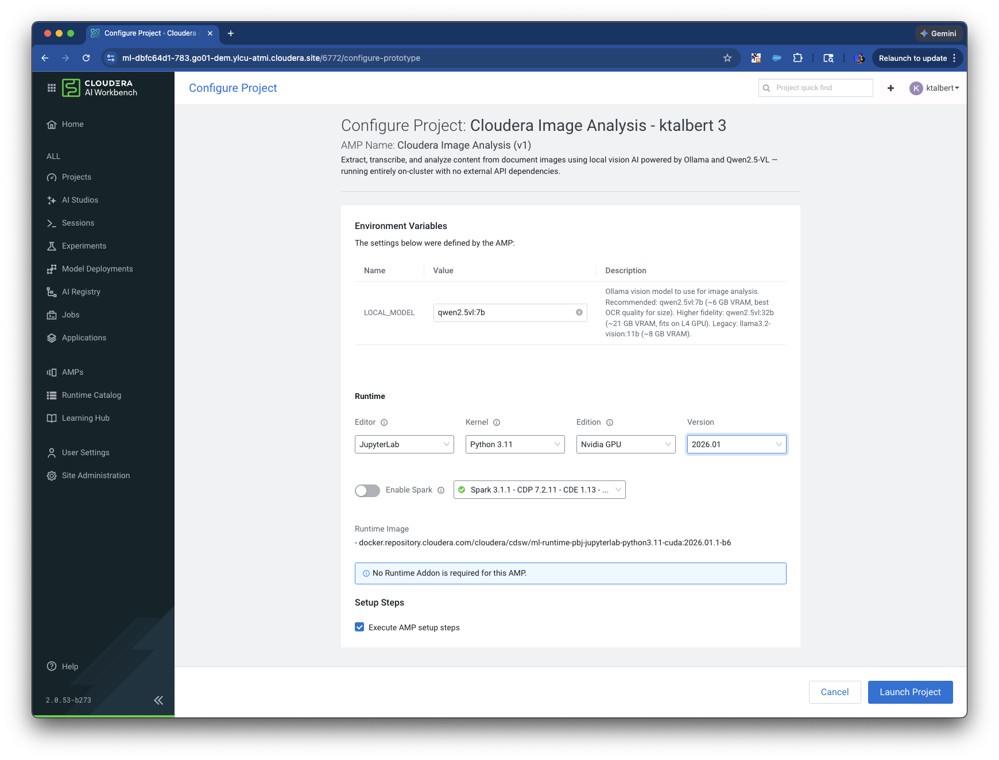 | 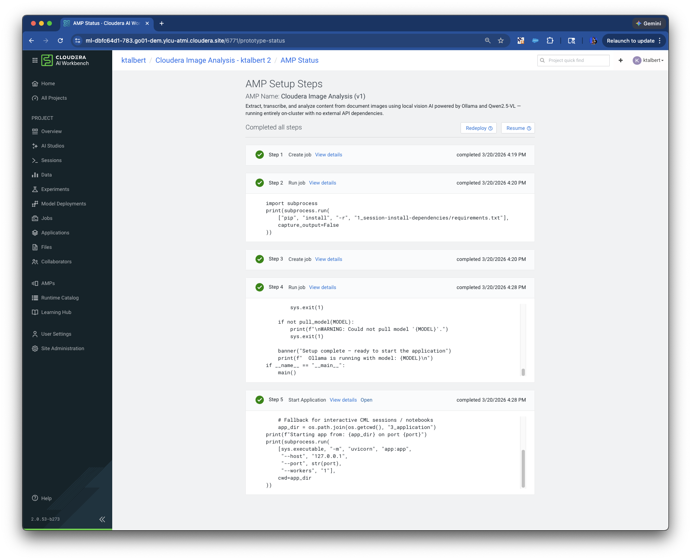 |

---

### Image Analysis

The **Image Analysis** page shows a side-by-side split: your image on the left, the streaming result on the right. Choose a use case from the top bar and click **Process Image**.

#### Transcribing Typed Text
Verbatim OCR — every character, line break, and punctuation mark exactly as printed. Handles dense technical content including code and structured headers.

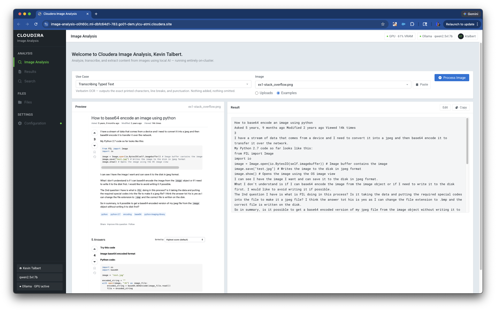

#### Transcribing Handwritten Text
Character-by-character digitisation of handwritten notes. Preserves original spelling, capitalisation, and line structure.

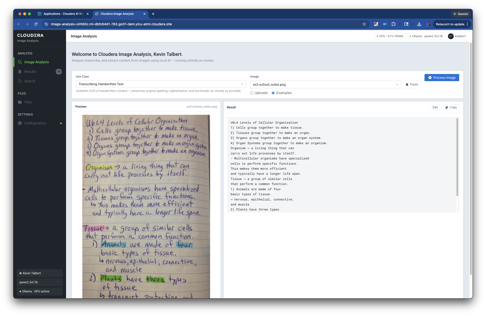

#### Transcribing Forms
Extracts every field and its value verbatim, one per line (`Field: Value`). Blank fields and checkboxes are preserved.

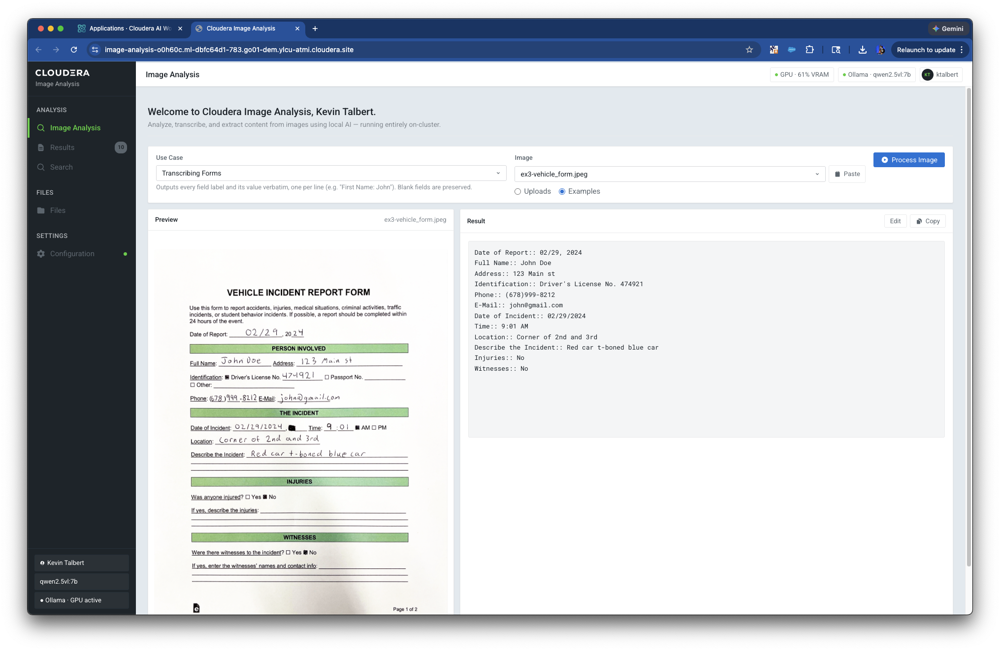

#### Complicated Document QA
Ask a specific question about the document. The model grounds its answer in the document content and cites the relevant section.

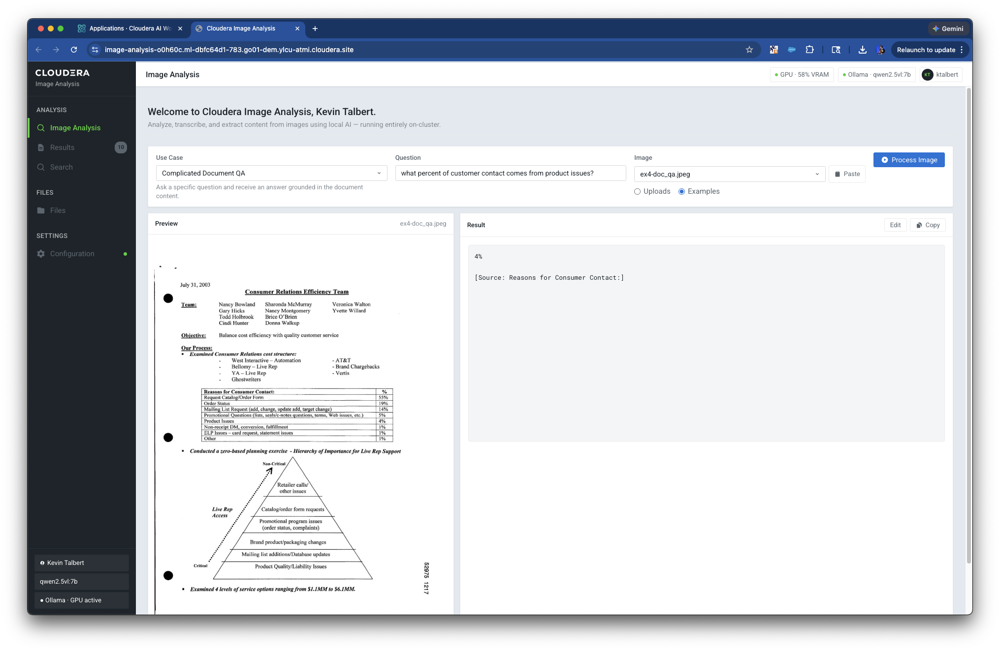

#### Unstructured Information → JSON
Converts any document — reports, org charts, tables, mixed layouts — into clean, structured JSON. Useful for downstream integrations and data pipelines.

| Document Report | Org Chart |
|---|---|
| 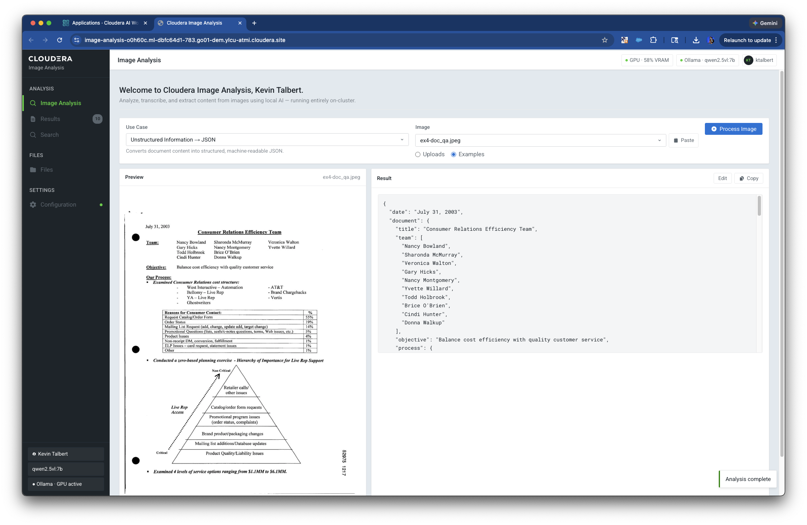 | 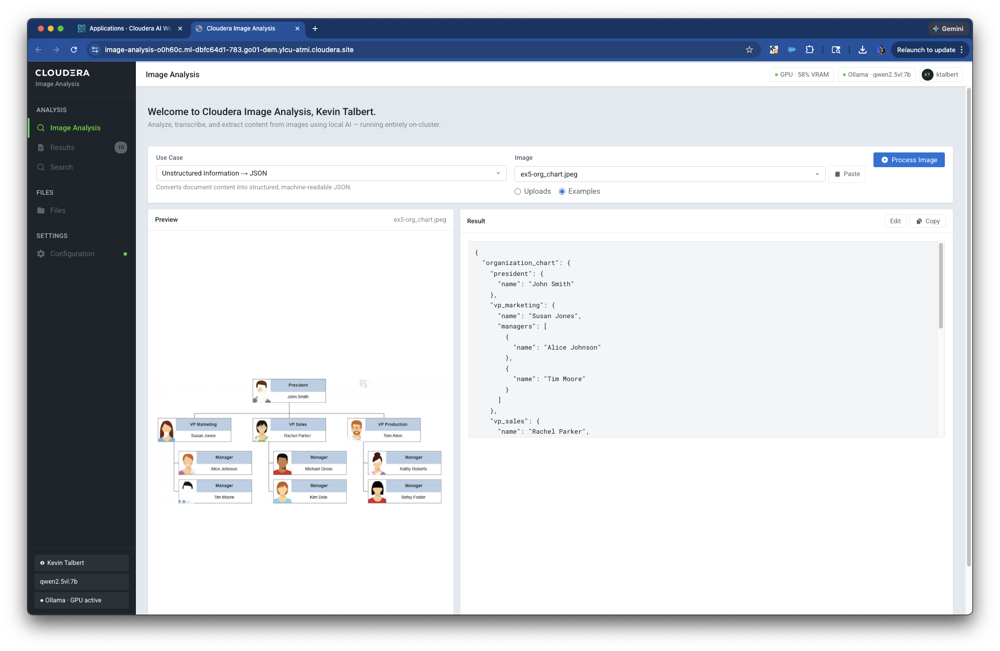 |

---

### Files — Batch Processing

The **Files** section is the hub for batch workflows. Create folders, upload images (including PDFs — auto-split to per-page images), select files, assign use cases, and queue jobs. Results are saved as `OCR_*.txt` files and downloadable as ZIP or CSV.

- **Select files individually or all at once** using checkboxes or `Ctrl+A`
- **Per-file use case override** — click the badge on any tile to set a different analysis mode before queuing
- **Rename** files and folders inline; associated OCR results are renamed automatically
- **OCR badge** on processed tiles opens the result directly in a preview modal

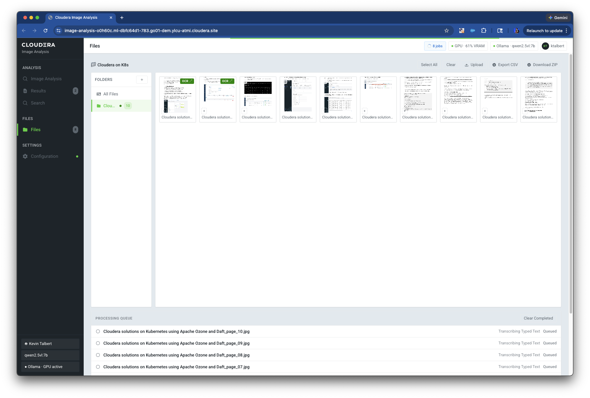

---

### Results

The **Results** page lists all completed batch jobs. Each card is expandable and shows the full extracted text. Copy to clipboard or download all results as a ZIP or CSV export.

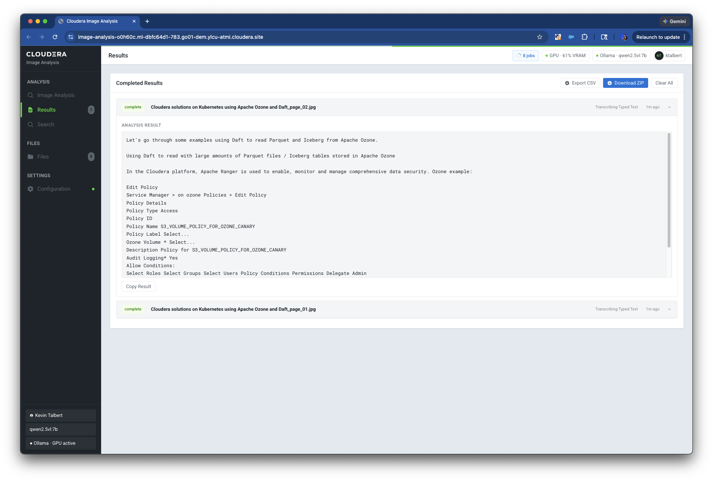

---

### Search

The **Search** page performs full-text search across all saved OCR results. Matching terms are highlighted in context snippets. Click any result to open the full document view.

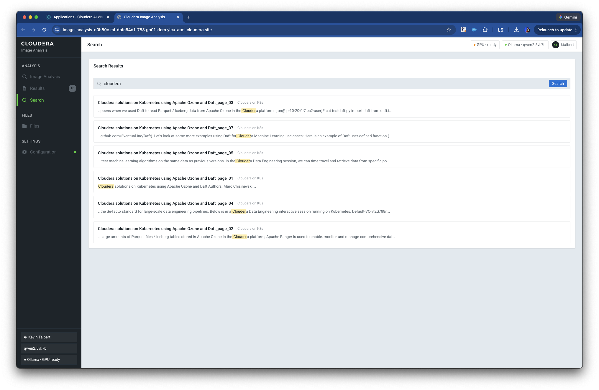

---

### Configuration

The **Configuration** page shows live Ollama and GPU status, lets you switch the active model, pull new models from the Ollama registry, and view the Ollama server log for diagnostics. VRAM usage is sourced directly from Ollama — accurate even in virtualised CAI GPU environments.

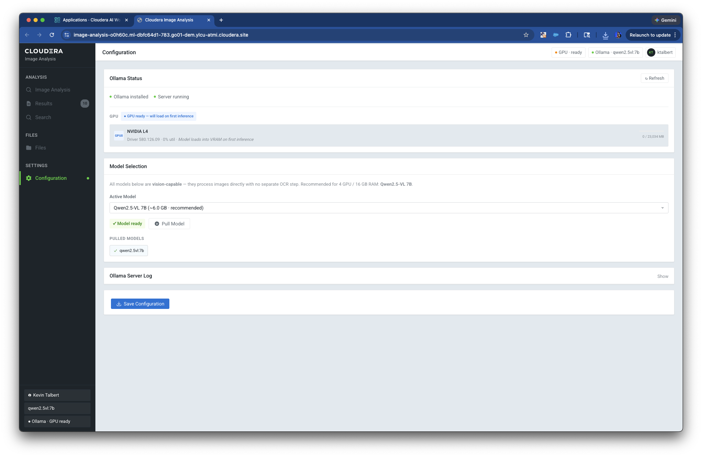

---

## Architecture

```
Image (PNG / JPG / WEBP / GIF / PDF)
        │
        ▼  PDF → per-page JPEGs via pypdfium2 (PDFium / BSD)
        │
        ▼
  prepare_image()          ← resize to 1280px max, JPEG quality 92
        │
        ▼
  Ollama /api/chat         ← qwen2.5vl:7b (default) running on local GPU
        │   JSON Schema format constraint per use case
        │   (grammar-enforced structured output)
        ▼
  _parse_structured_response()  ← renders schema output to display text
        │
        ▼
  Streaming SSE  ──────────────────────────▶  Browser (token-by-token)
        │
        ▼
  OCR_*.txt saved to RESULTS_DIR/{folder}/   ← persistent, searchable
```

### Why Qwen2.5-VL?

| Model | OCRBench | DocVQA | VRAM |
|---|---|---|---|
| **Qwen2.5-VL 7B** (default) | **864 / 1000** | **95.7%** | ~6 GB |
| Qwen2.5-VL 32B (optional) | higher | **96.4%** | ~21 GB |
| Llama 3.2 Vision 11B (legacy) | ~600 | ~80% | ~8 GB |

Qwen2.5-VL is purpose-built for document understanding with dynamic-resolution image encoding (28×28 patches), 125K context window, and native structured output support.

### Output guardrails

Structured use cases (Forms, QA, Summarize) pass a **JSON Schema** as Ollama's `format` parameter — enforced at the token-sampling level via GBNF grammars. The model cannot produce text outside the schema, eliminating hallucinated commentary without post-hoc filtering.

Transcription use cases (Typed Text, Handwritten Text) use plain-text streaming with aggressive sampling parameters (`temperature: 0.05`, `repeat_penalty: 1.5`, `repeat_last_n: 256`) plus a server-side repetition detector that truncates looping output before it reaches the user.

---

## Deployment on Cloudera Machine Learning (CAI)

This is a CAI **Accelerator for ML Projects (AMP)**. Deploy from the CAI catalog or clone this repository directly as a CAI project.

### Automated setup (`.project-metadata.yaml`)

| Step | Script | What it does |
|---|---|---|
| 1 | `1_session-install-dependencies/install.py` | Installs Python dependencies |
| 2 | `2_setup_models/setup_models.py` | Installs Ollama (no root), pulls `qwen2.5vl:7b` |
| 3 | `3_application/start-app.py` | Launches FastAPI + custom HTML/CSS/JS UI |

### Environment variables

| Variable | Default | Description |
|---|---|---|
| `LOCAL_MODEL` | `qwen2.5vl:7b` | Ollama model to pull and use. Options: `qwen2.5vl:7b`, `qwen2.5vl:32b`, `llama3.2-vision:11b` |

### Resource requirements

| Resource | Recommended |
|---|---|
| GPU | 1 × NVIDIA L4 (24 GB) or equivalent |
| VRAM | 6 GB minimum (qwen2.5vl:7b), 21 GB for 32b |
| CPU | 4 cores |
| RAM | 16 GB |

---

## Features

### Single Image Analysis
Select a use case, choose an uploaded or example image, and click **Process Image**. Results stream token-by-token in a side-by-side split view alongside the original image. A **Stop** button cancels in-flight generation. Results can be edited inline and saved back to disk.

### PDF Support
Upload PDF files directly — the application automatically splits each page into a separate image using **pypdfium2** (PDFium, BSD/Apache-2.0 licensed). A 10-page PDF becomes 10 individually processable images, with results assembled in page order.

### Batch Processing
Select multiple images (or entire folders) from the Files section and queue them for processing. Jobs run in a background queue; results are saved as `OCR_*.txt` files automatically. Per-file use case overrides let you assign different analysis modes to different files before a single queue submission.

### Full-Text Search
The Search section performs full-text search across all saved OCR results. Results include highlighted snippets showing the match in context, and clicking any result opens the full document view.

### Extraction Templates
Beyond the six built-in use cases, Templates provide pre-configured extraction schemas for common document types: Invoice, Receipt, Business Card, Purchase Order, Medical Intake Form, and ID/Passport.

### Export
Results can be downloaded as:
- **ZIP** — all `OCR_*.txt` files, preserving folder structure
- **CSV** — one row per document; JSON extraction results are flattened to spreadsheet columns

### Folder & File Management
- Create named folders and upload images directly into them
- Rename folders inline — associated OCR results are moved automatically
- Rename individual images — the corresponding `OCR_*.txt` is renamed and its internal header updated
- Enlarge any thumbnail into a full-screen lightbox with a single click
- Keyboard shortcuts: `Space` to select, arrows to navigate, `Enter` to queue, `Ctrl+A` to select all

### Configuration
Change the active model, view live GPU status and VRAM usage (sourced from Ollama, not nvidia-smi), pull new models from the Ollama registry, and inspect the Ollama server log — all from the UI without restarting the application.

---

## Local Development

```bash
# Install dependencies
pip install -r 1_session-install-dependencies/requirements.txt

# Install Ollama and pull the model
python 2_setup_models/setup_models.py

# Run the app
python 3_application/start-app.py
```

The app listens on `$CDSW_APP_PORT` (default `8090`).

---

## Project Structure

```
.
├── 1_session-install-dependencies/
│   ├── requirements.txt          # Python dependencies (pypdfium2, Pillow, FastAPI, …)
│   └── install.py                # CAI job: pip install
├── 2_setup_models/
│   └── setup_models.py           # CAI job: installs Ollama + pulls model
├── 3_application/
│   ├── app.py                    # FastAPI backend
│   ├── start-app.py              # CAI application entry point
│   └── static/
│       ├── index.html            # Single-page UI
│       ├── styles.css            # Cloudera Workbench design system
│       └── app.js                # Frontend logic
├── assets/                       # Screenshots and catalog preview image
├── data/
│   └── examples/                 # Bundled example images
│       ├── ex1-stack_overflow.png
│       ├── ex2-school_notes.png
│       ├── ex3-vehicle_form.jpeg
│       ├── ex4-doc_qa.jpeg
│       └── ex5-org_chart.jpeg
├── .project-metadata.yaml        # CAI AMP deployment specification
├── catalog-entry.yaml            # Cloudera catalog metadata
└── README.md
```

---

## License

Apache 2.0 — see [LICENSE](LICENSE).
